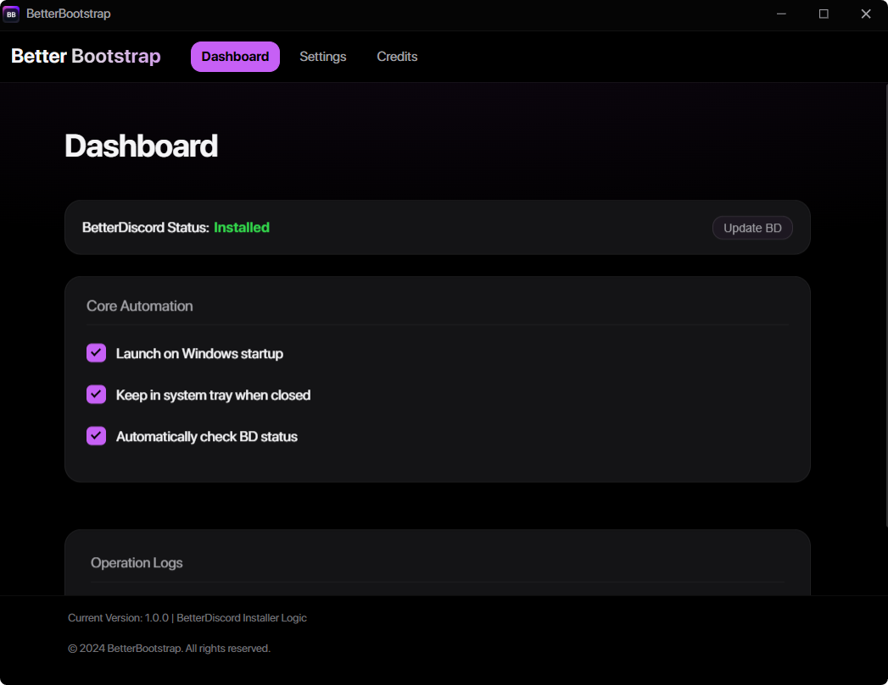

# BetterBootstrap (UNOFFICIAL)


<br><br>

## Update:  I want to clearly state that this is completely unofficial and not affiliated with them in any way. As much as I’d love the opportunity to collaborate, I fully respect their concerns and boundaries. That said, this project is open source and made independently with no intention of causing issues.

<br><br>

## Screenshot



A simple, modern application built with Electron to manage your BetterDiscord installation. It aims to automate and simplify installing, uninstalling, and repairing BetterDiscord.

## Features

*   **Install/Update:** Downloads the latest BetterDiscord ASAR and injects it into detected Discord installations.
*   **Uninstall:** Removes the BetterDiscord injection shim and deletes the core `betterdiscord.asar` file.
*   **Repair:** Resets BetterDiscord by removing shims and plugin configurations, then prompts for reinstallation.
*   **Automatic Installation (Optional):** Can automatically install BetterDiscord on launch if it's not detected (configurable in settings).
*   **Status Detection:** Checks if BetterDiscord's core file exists.
*   **Process Management:** Kills Discord processes before modification and restarts them afterward.
*   **Clean UI:** Simple dashboard and settings interface with operation logs.
*   **System Tray Integration (Optional):** Run the app minimized in the system tray.
*   **Launch on Startup (Optional):** Configure the app to start when you log in to Windows.

## Installation & Usage

There are two ways to use BetterBootstrap: running the pre-built executable or running from the source code.

### Option 1: Using the Pre-Built Executable (Recommended for most users)

1.  **Download:** Obtain the latest `BetterBootstrap.exe` file from the [Releases section](<link-to-your-releases-page>). <!-- *** IMPORTANT: Replace with the actual link to your GitHub releases *** -->
2.  **Run:** Double-click the downloaded `.exe` file. No installation is required.
3.  **Usage:**
    *   Use the **Dashboard** to see the BD status and click "Install/Update BD".
    *   Use **Settings** for "Repair" or "Uninstall" actions.
    *   Configure startup, tray, and notification behavior in the Dashboard and Settings tabs.
    *   Check the **Logs** section on the Dashboard during operations for details.
    *   Right-click the **System Tray** icon (if enabled) for quick actions.

### Option 2: Running from Source Code (For development or building yourself)

1.  **Prerequisites:**
    *   [Node.js](https://nodejs.org/) installed on your system.
    *   Git (optional, for cloning).
2.  **Get the Code:**
    *   Clone the repository: `git clone <repository-url>`
    *   OR Download the source code ZIP and extract it.
3.  **Navigate to Directory:** Open a terminal or command prompt and `cd` into the project directory (e.g., `betterbootstrap-app`).
4.  **Install Dependencies:** Run `npm install`. This downloads Electron and other required packages.
5.  **Run the App:** Execute `npm start` in your terminal. This will launch the application directly using Electron.
6.  **Usage:** The application interface and functionality are the same as described in Option 1. Use the UI to manage BetterDiscord. Check the terminal window where you ran `npm start` *and* the in-app logs for detailed output.

## Building Your Own Executable (`.exe`)

If you have run the application from source (Option 2) and want to create your own portable `.exe`:

1.  **Install `electron-builder` (if not already done):**
    ```bash
    npm install --save-dev electron-builder
    ```

2.  **Configure `package.json`:** Ensure the `build` section in `package.json` is configured correctly (see previous `README` version or `package.json` in the source for an example). Pay attention to `appId`, `productName`, included `files`, and the `win.icon` path.

3.  **Run the Build Command:**
    ```bash
    npm run build
    ```
    *(Note: The exact command might be `npm run dist` or similar depending on how the build script is named in `package.json`)*

4.  **Output:** `electron-builder` will create a `dist` folder (or the configured output directory) containing your portable `.exe` file (e.g., `BetterBootstrap_1.0.0_Portable.exe`).

## Troubleshooting

*   **UI Issues (Blank Screen, Buttons Stuck, Logs Not Showing):**
    *   If running from source, check the DevTools console (`Ctrl+Shift+I`) for errors, especially related to `preload.js` or `renderer.js`.
    *   Ensure `preload.js` is correctly exposing `electronAPI` and IPC channel names match exactly across `main.js`, `preload.js`, and `renderer.js`.
*   **Install/Uninstall/Repair Fails:**
    *   Run from source (`npm start`) to see detailed logs in your terminal.
    *   Ensure Discord is fully closed before starting operations (check Task Manager/System Tray).
    *   Check file permissions for `%AppData%\BetterDiscord` and Discord's installation folders (`%LocalAppData%\Discord` etc.).
    *   Temporarily disable antivirus software to rule out interference.
*   **BD Status Incorrect:**
    *   Verify the `checkBdBasicInstall` function in `main.js` correctly checks for `BetterDiscord\data\betterdiscord.asar` using `original-fs` and performs a size check.
    *   Ensure the `bd-status` IPC event is correctly handled in `renderer.js`.

## Credits

*   **BetterDiscord Team (Zerebos et al.):** For creating and maintaining BetterDiscord. ([Project Link](https://github.com/BetterDiscord/BetterDiscord))
*   **Germanized:** For the original BetterBootstrap concept and UI design. ([GitHub Profile](https://github.com/Germanized))
*   **Electron:** For the framework used to build this application. ([Electron Website](https://www.electronjs.org/))
*   **Node.js Modules:** `electron-store`, `find-process`, `tree-kill`, `phin`.
*   **Contributors:** No one so far I dont know any developers

## License

This project is licensed under the MIT License  - see the LICENSE file for details. 
